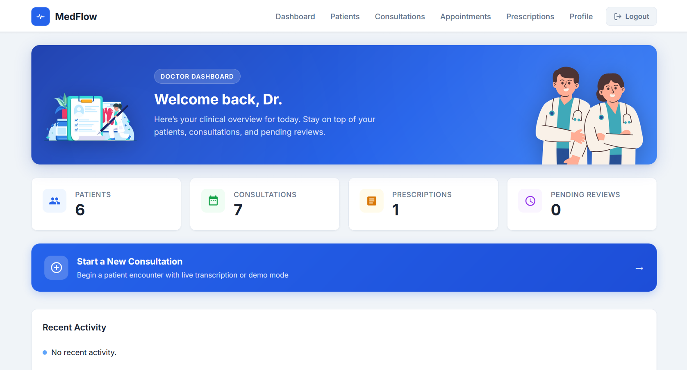
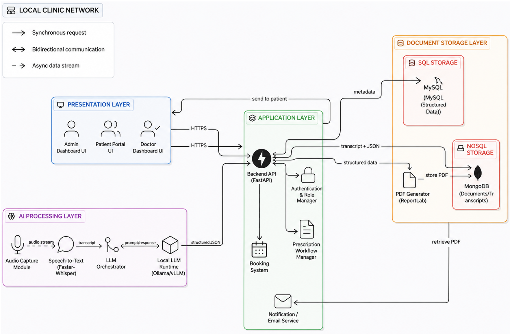
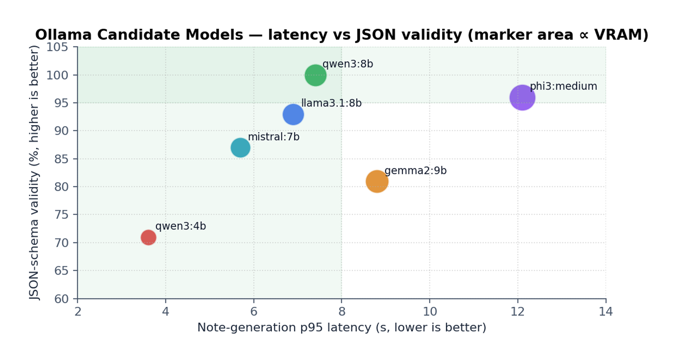
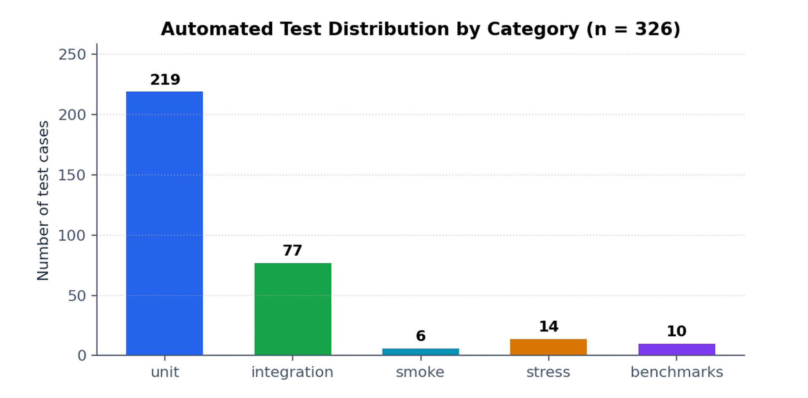

# MedFlow 🩺



MedFlow is a local-first consultation support system created by a six-student Software Engineering team at the University of Southern Denmark. It records outpatient consultations, transcribes them locally, produces structured clinical draft material, and keeps the doctor in control of every approval.

Sensitive consultation data stays within the local deployment. AI output is advisory and editable; nothing is accepted as clinical content without explicit doctor approval.

## What It Does

- Records consultation audio and transcribes it with Faster-Whisper.
- Generates structured draft reports through Ollama and Qwen3:8b.
- Supports review, editing, approval, PDF export, email follow-up, and auditability.
- Uses MySQL for relational records and MongoDB for flexible AI artifacts.

## Run Locally

Requirements: Docker Desktop. An NVIDIA GPU is optional; the transcription service falls back to CPU.

```bash
git clone https://github.com/MRM-MB/MEDFLOW.git
cd MEDFLOW
cp .env.example .env
docker compose up -d --build
docker compose exec ollama ollama pull qwen3:8b
```

Open the application at <http://localhost:8000> and the local MailHog inbox at <http://localhost:8025>.

The first build downloads the Faster-Whisper `large-v3` model. The Ollama command downloads Qwen3:8b once and stores it in the Docker volume.

### Demo Access

All demo accounts use the password `password`.

| Role | Email |
| --- | --- |
| Doctor | `doctor@example.local` |
| Admin | `admin@example.local` |
| Patient | `giulia@example.local` |

## Architecture



The FastAPI application coordinates MySQL, MongoDB, an Ollama local LLM, and a Faster-Whisper sidecar. The code follows Clean Architecture boundaries, allowing the infrastructure integrations to evolve independently.

## Local AI and Validation



Qwen3:8b was selected for reliable structured output within the available local hardware budget. The project includes unit, integration, smoke, stress, benchmark, and UI validation.



Run the automated suite inside the application container:

```bash
docker compose exec app pytest
```

## Project Material

- `docs/` contains the diagrams and supporting documentation.
- `Validation_Reports/` contains the validation evidence and charts.
- `overleaf-report/` contains the source for the project report.

To stop the local environment while preserving data:

```bash
docker compose down
```
## 👥 Contributors

<table width="100%">
  <thead>
    <tr>
      <th>Name</th>
      <th>GitHub Profile</th>
    </tr>
  </thead>
  <tbody>
    <tr>
      <td><b>Luigi</b></td>
      <td><a href="https://github.com/Lucol24">Lucol24</a></td>
    </tr>
    <tr>
      <td><b>Aleksandra</b></td>
      <td><a href="https://github.com/Kwiatek05">Kwiatek05</a></td>
    </tr>
    <tr>
      <td><b>Gabriele</b></td>
      <td><a href="https://github.com/Gabbo693">Gabbo693</a></td>
    </tr>
    <tr>
      <td><b>Gabija</b></td>
      <td><a href="https://github.com/GabijaSt">GabijaSt</a></td>
    </tr>
    <tr>
      <td><b>Mats</b></td>
      <td><a href="https://github.com/mqts241">mqts241</a></td>
    </tr>
    <tr>
      <td><b>Manish</b></td>
      <td>-</td>
    </tr>
  </tbody>
</table>
