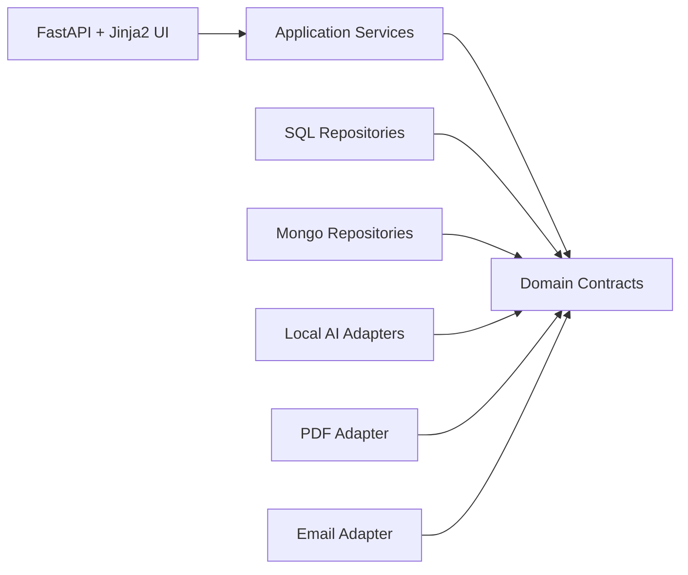

# OPD-Vertex Architecture

## Layered Architecture

The scaffold follows a clean, layered structure:

- Presentation: FastAPI routes, request handlers, Jinja templates
- Application: use-case orchestration and workflow services
- Domain: entities, enums, DTOs, ports, and business-facing contracts
- Infrastructure: mock adapters today, replaceable external integrations later

Dependency direction is inward: presentation depends on application, application depends on domain, infrastructure implements domain contracts.

## Component Diagram

## Module Responsibilities

- Auth: login/logout scaffolding, staff identity placeholders, future RBAC entry point
- Patients: patient DTOs, repository contracts, list/detail/create flows
- Consultations: consultation lifecycle scaffold and review entry point
- Transcription: local speech-to-text port and placeholder adapter
- Clinical Notes: generated note and prescription draft contracts
- Suggestive Mode: independent safety-review contract and DTOs
- Prescriptions: finalized prescription model and versioning-ready repository contract
- PDF: ReportLab-targeted port only
- Email: template repository and sender port only
- Audit: audit log entity and repository interface
- Admin: prompt and email template config management placeholders

## Replaceable AI Adapters

Transcription and note generation are separate ports on purpose. The transcription module targets Faster-Whisper, while transcript normalization, report generation, and suggestive mode target a single local Ollama model: `qwen3:8b`. They do not depend on each other directly.

## SQL / NoSQL Split

Planned SQL ownership:

- `staff`
- `patients`
- `consultations`
- `prescriptions`
- `audit_logs`

Planned Mongo ownership:

- `email_templates`
- `llm_prompts`
- `generated_documents`
- `consultation_documents`

`consultation_id` is the shared linkage key between relational records and document records. Draft transcripts and generated outputs are designed to stay in Mongo while the consultation is in progress, because iterative AI-generated artifacts fit a document model and may evolve quickly. Once a doctor approves a prescription, the finalized prescription should be projected into SQL for versioned, transactional reporting and operational integrity.

## Consultation Workflow

`recording -> transcribing -> processing -> review -> approved/rejected/cancelled`

Implemented workflow:

- Faster-Whisper persists raw transcript text to MongoDB
- Transcript normalization runs in `processing`
- Clinical report generation runs in `processing`
- Suggestive review runs before doctor approval
- Approved prescription data is projected into SQL only after doctor approval
